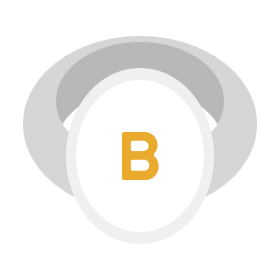
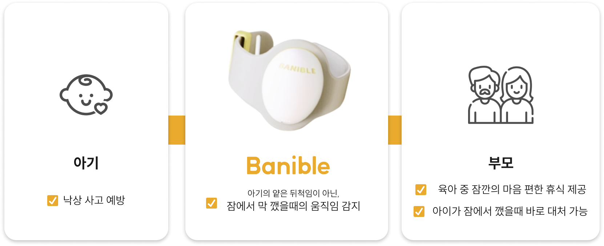
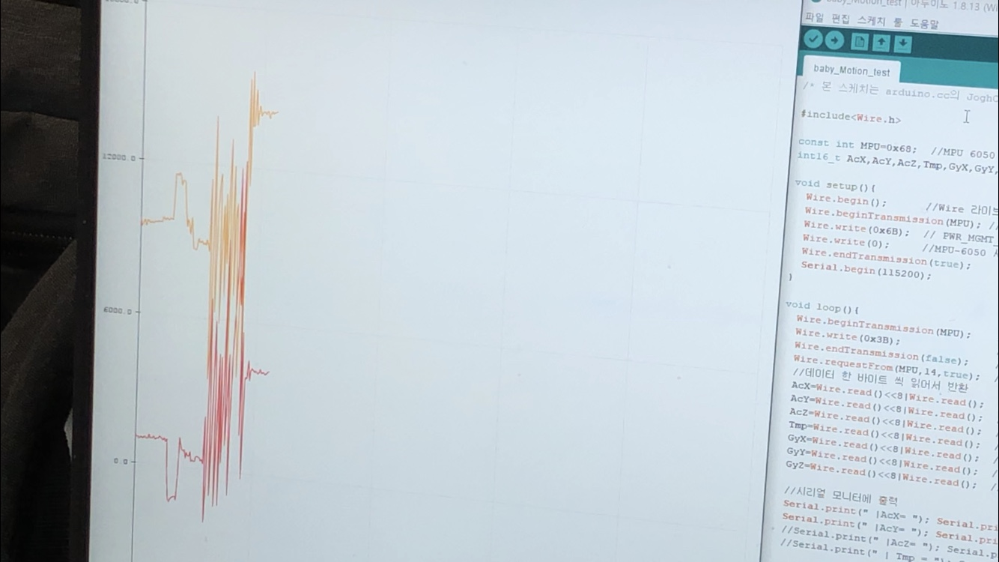
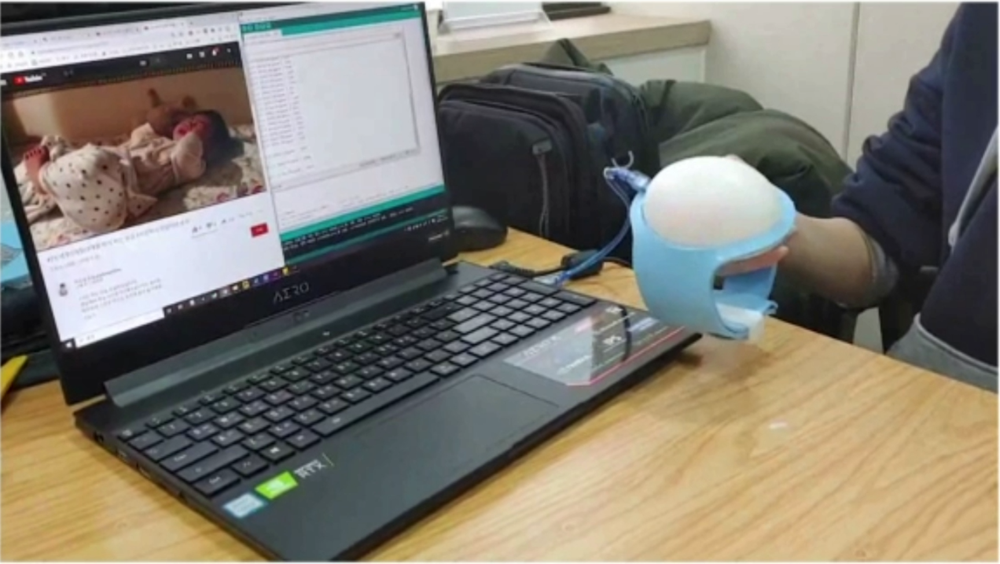
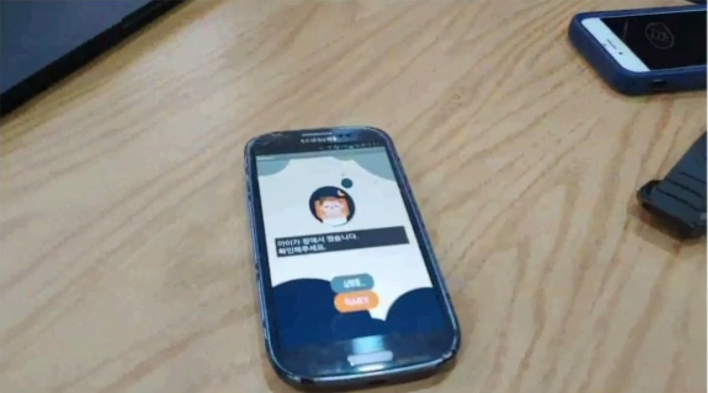

# **Banible**
### 유아 움직임 감지 웨어러블 밴드
 

## 💡 **Project Info**

>📅 기간 : 2019.09 ~ 2019.12

> - 경영, 글로벌 서비스, 산업디자인 전공으로 이루어진 **팀 프로젝트** 
> - Design Thinking 기법을 적용한 프로젝트 
> - 주제 선정(공통), **아두이노를 이용한 기능 구현** 담당
 

## 💡 **Project  Summary**
 

   
  영유아 낙상사고를 예방 할 수 있는 제품 제작

 

## 💡 **Dev Environment**
 

- Arduino IDA, MIT App Inventor , Android  
- Arduino NANO 
- 자이로 센서 : MPU-6050 
- 블루투스 센서: HC-06 

## 💡 **Contents**

 
 
 

1. 잔 움직임과 깨어났을때의 움직임 감지를 위해, 아이가 잠을 자는 비디오 영상을 수집하여 뒤척임 데이터 분석 
2. 이후 직접 센서를 착용해 보며 자이로센서의 적절한 민감도 보정 및 선정하는 과정 수행 
3. 일정 값 이상이 되면 아두이노에서 Bluetooth 모듈을 이용해 핸드폰 어플로 신호를 보내며, 어플에서 알림이 가게 됨. 

##  **More Info. about PJ**
###  **👇Clik the LOGO👇**
 

